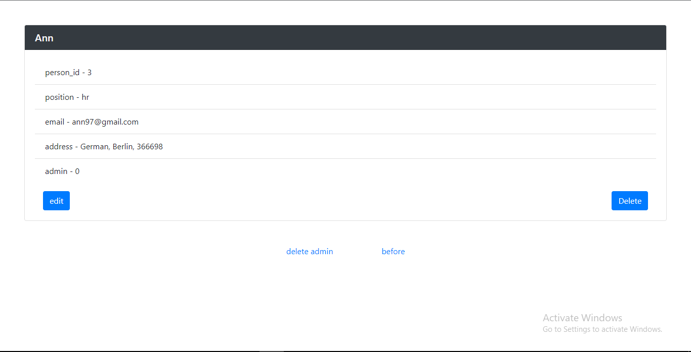

# Crud system
## Create / Read / Update / Delete persons

This crud system based on mysql database. Also use spring framework, spring mvc, thymeleaf and hibernate validator

#### _main page with all persons_

#### _page with all info about person_

#### _select admin_

#### _update or create person_
